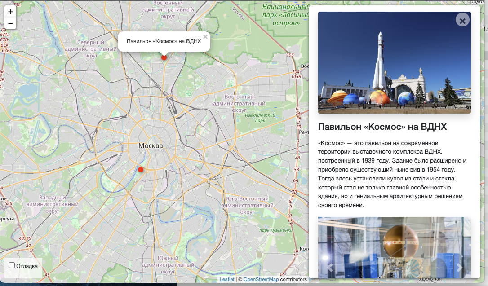

# Interactive Map of Moscow

[Demo Site](https://originalmalek.pythonanywhere.com/).  
[Json file example](https://raw.githubusercontent.com/devmanorg/where-to-go-frontend/master/places/moscow_legends.json).

Python 3.11

## Running the Site

- Download the code
- Install the dependencies using the command `pip install -r requirements.txt`
- Create the database with the command `python3 manage.py migrate`
- Start the server using the command `python3 manage.py runserver`

## How to Add Data
(Data is stored in the *media/data* folder in *.json* format.)
- To add a file, run the command `python3 manage.py load_place "https://raw.githubusercontent.com/devmanorg/where-to-go-frontend/master/places/moscow_legends.json"`

or

- Run json_to_db.py file for upload excursions info from 'content' directory with commands:  
`cd places`  
`python3 json_to_db.py`  

json_to_db.py is python script is utilized in Django projects to automate the process of loading content from JSON files into a Django model's fields. It is particularly valuable when dealing with large amounts of data that needs to be injected into your Django models.

## Environment Variables

Some of the project settings come from environment variables. 
To define them, create a file named `.env` in the same directory as `manage.py`, 
and write the data in this format: `VARIABLE=value`.

Variables include:
- `SECRET_KEY` — This is a secret key for this particular Django installation. It is used to provide cryptographic signing and should be set to a unique, unpredictable value. It is critical to keep this information secure. [More info](https://docs.djangoproject.com/en/5.0/ref/settings/#std:setting-SECRET_KEY)

- `DEBUG` — This is a boolean that turns debug mode on or off. If set to `True`, when your app raises an exception, Django will display a detailed traceback, including a lot of metadata about your environment, such as all the currently defined Django settings (from settings.py). You should set `DEBUG=False` for production deployment. [More info](https://docs.djangoproject.com/en/stable/ref/settings/#debug)

- `SESSION_COOKIE_SECURE` — This is a boolean attribute that indicates whether to use a secure cookie for the session cookie. If set to `True`, the cookie will be marked as "secure", which means browsers may ensure that the cookie is only sent with an HTTPS connection. [More info](https://docs.djangoproject.com/en/5.0/ref/settings/#session-cookie-secure)

- `CSRF_COOKIE_SECURE` — This is a boolean attribute that determines whether to use a secure cookie for the CSRF cookie. If set to `True`, the cookie will be marked as "secure", which means browsers may ensure that the cookie is only sent under an HTTPS connection. [More info](https://docs.djangoproject.com/en/5.0/ref/settings/#csrf-cookie-secure)

- `STATIC` — This designates the local filesystem path that will hold static files collected with the collectstatic management command. [More info](https://docs.djangoproject.com/en/stable/ref/settings/#static-root)

- `ALLOWED_HOSTS` — This is a list of strings representing the host/domain names that this Django site can serve. This is a security measure to prevent HTTP Host header attacks, which are possible under many types of web server configurations. [More info](https://docs.djangoproject.com/en/5.0/ref/settings/#allowed-hosts)
